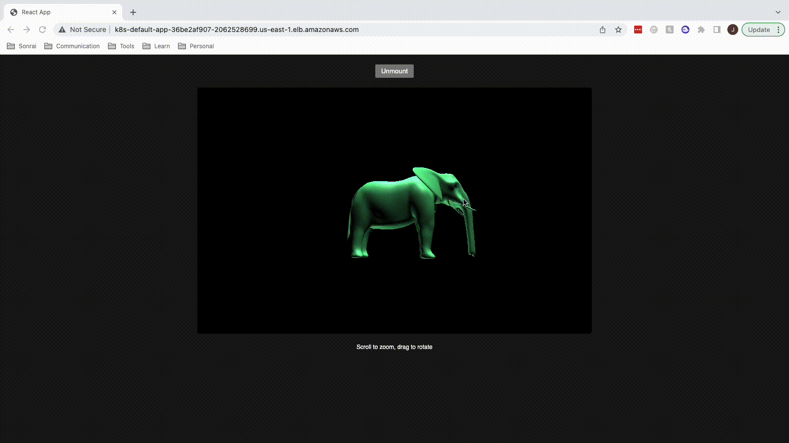

# Organization Overview

<p style="text-align:center;">
    
</p>


Checkout the live [demo.](http://k8s-default-app-36be2af907-2062528699.us-east-1.elb.amazonaws.com/)

# Projects

[infrastructure](https://github.com/Joshua-CICD/infrastructure)
- Terraform code for provisioning AWS resources
- Modularized for easy reuse to create new environments
- EC2 automatically scale based on load

[frontend](https://github.com/Joshua-CICD/frontend)


- Built with React
- Uses GitHub actions to automate Continuous Integration
- Runs cypress as the testing framework
- Pushes image to ECR repository
- Big Shout out to [Alexander Solovyev](https://github.com/supromikali/react-three-obj-loader) for base app

```text
Note: Because this is demo I wanted to serve the 
files with a python server. But in reality I would 
make this repo all encapsulating.
```

[backend](https://github.com/Joshua-CICD/backend)


- Built with Python/Flask
- Uses GitHub actions to automate Continuous Integration
- Runs pytest as the testing framework
- Pushes image to ECR repository

[flux](https://github.com/Joshua-CICD/flux)
- Automated deployment with gitOps.
- Kubernetes manifests for deploying the application

# What would make this better?

### CI/CD
1. Add code coverage to the CI (frontend/backend)
2. Add image/code scanning to the CI (frontend/backend)
3. Add yaml linting to the CI (flux)
4. Add a CI/CD pipeline for the (infrastructure)
5. Implement some kind of Canary deployments.
6. Add acceptance tests
7. Add load tests
8. Add End-2-End tests

### App Improvements
1. Add database for storing multiple .obj files
2. Create a notes feature to collaborate.
3. It would be really cool if this project could create an extension
for blender that would allow you to upload your .obj file directly.

### Infrastructure
1. Add a nice domain name and SSL certificate.
2. Add prometheus for system monitoring and alerting
