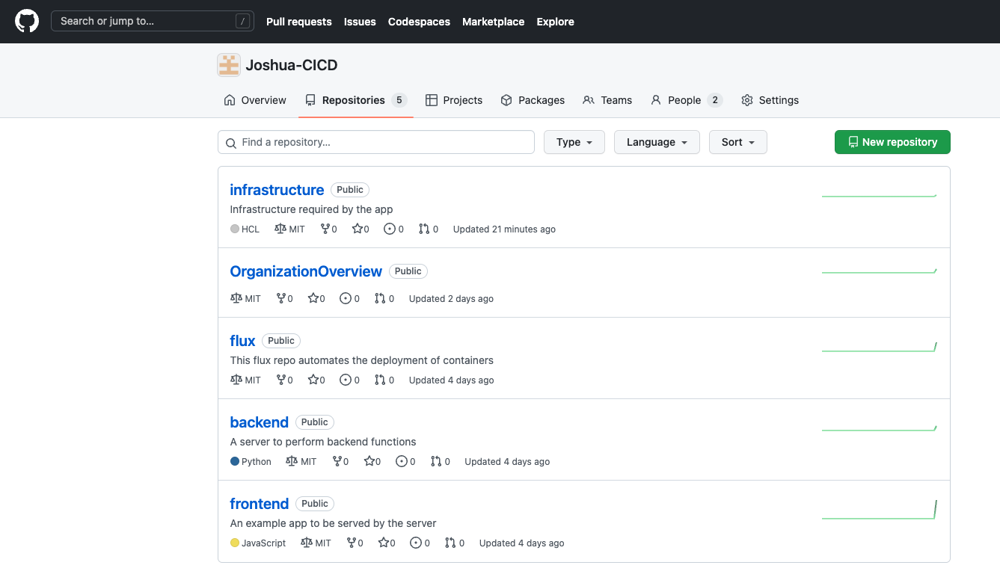
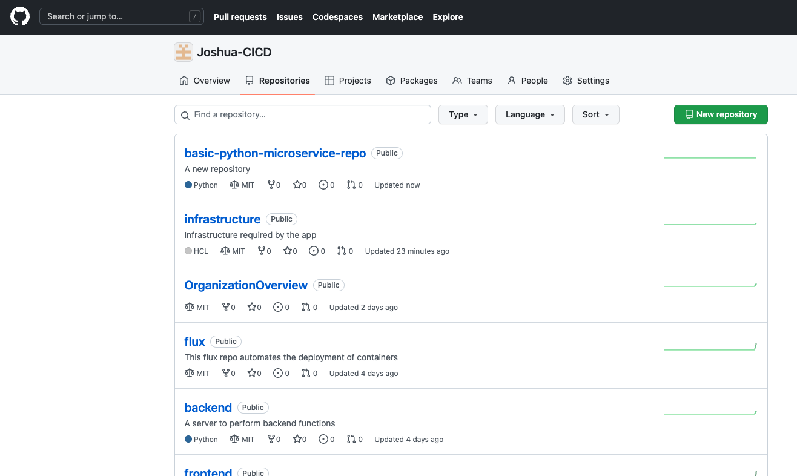
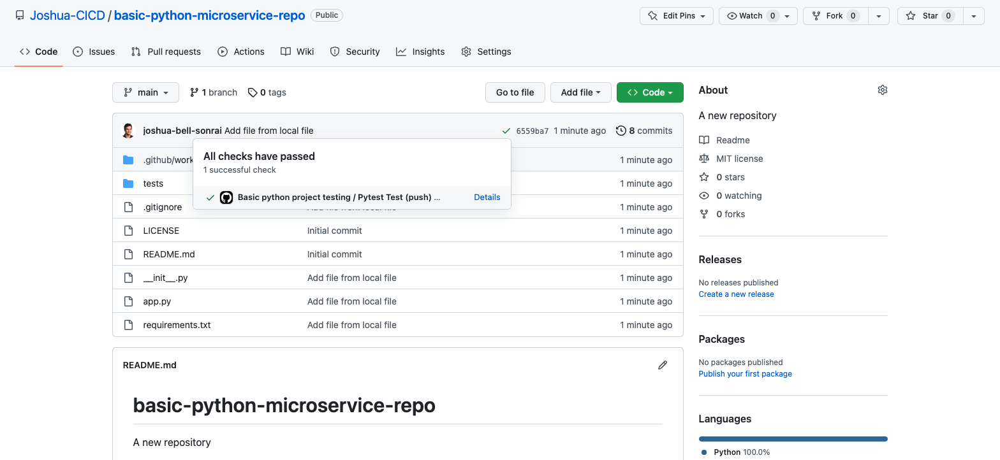

# Create GitHub Repos

Wouldn't it be nice if you could create python microservices 
repos with default test cases, CI/CD, and other goodies?

Well now you can! [Code to make it happen](https://github.com/Joshua-CICD/infrastructure/commit/9beebc32f205651a3b88f88c08613d2da5663fdf)

## Usage
Inside our [infrastructure](https://github.com/Joshua-CICD/infrastructure/blob/main/commons/github/main.tf)

Simply add another module like so:
```hcl
# Image repositories
module "basic_python_microservice_repo" {
  source = "../../modules/github/python"
  name = "basic-python-microservice-repo"
  token = var.token
}
```

1. `cd infrastructure/commons/github`
2. `terraform init`
3. `terraform apply`

```text
Note: you will be prompted for your GitHub token.
```

## What does it do?

**Note: there are only 5 repos**



**Note: there are 6 after the command**



**Note: Notice how the default repo comes with basecase pytest and CI integration**



